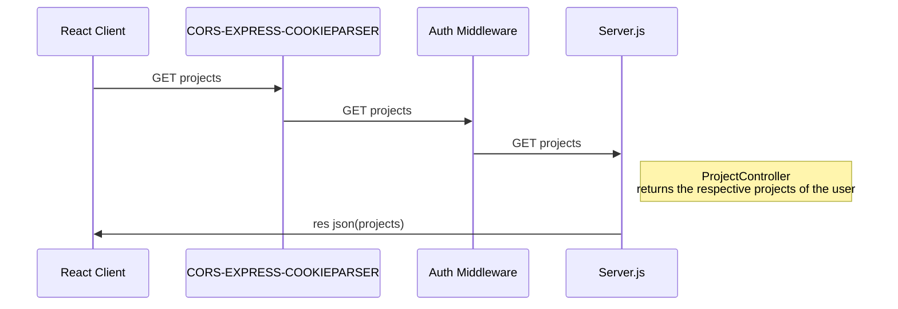

# Task Manager

Application for keeping track of the tasks for multiple projects.

## Requirements
Node 19.7.0
NPM 9.5.0
React 19.0.0

## Acquired knowledge on this project

 - Prisma -> For database ORM with PostgreSQL.
 - Socket-io -> For updating Project Dashboard when a task status is updated in any other session. 
 - Zustand -> State management persists after refreshing to store user info after login.
 - Tailwind -> CSS styles in an easy way.
 - BCrypt -> Encrypt and decrypt the password.
 - JWT -> Perform the API calls by storing the JWT on cookies (more secure than local storage).
 - Zod -> Schema validation library for some API calls.

## Run Locally

Install JavaScript for Node and React

```bash
  npm install
  cd client
  npm install
```
Start the server Node at the root project directory
```bash
  npm run start
```
Start React
```bash
  cd client/
  npm run start
```

## UML diagrams



